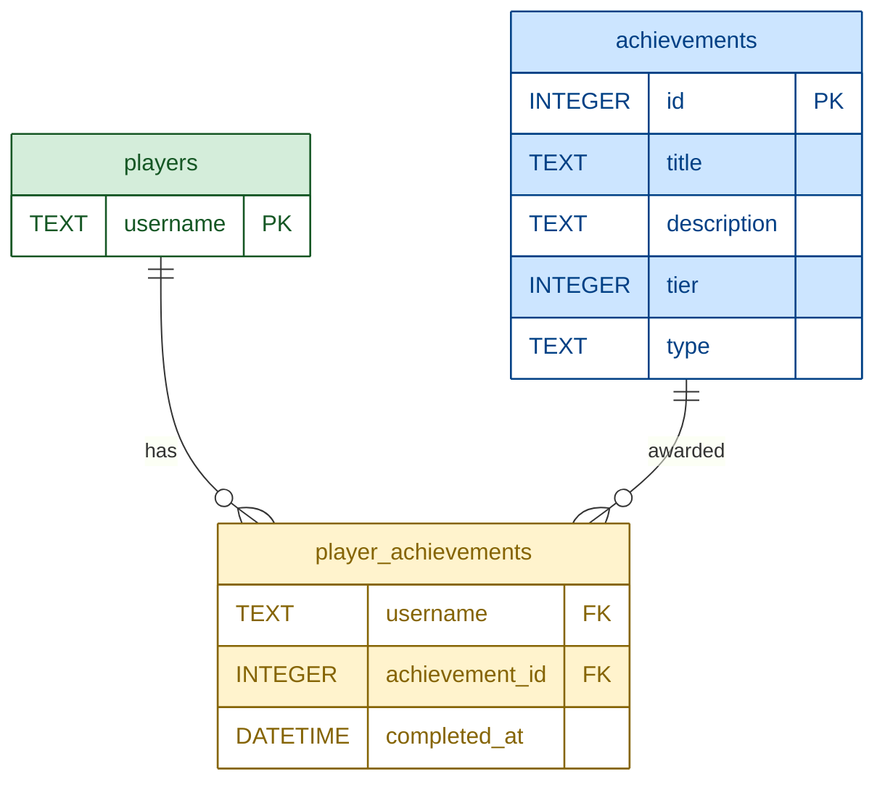

# ElevatedAchievements
The beauty about old versions of Minecraft is that they are very creative-driven. However, there may be times when players can't come up with something to work towards. ElevatedAchievements solves this by providing an expansive list of achievements for players to earn. The plugin listens to different player events and will notify them when they have earned an achievement. Players can earn rewards upon earning achievements.

## Installation

### Option 1: JAR Download (Non-technical)
The [Releases](https://github.com/narlock/ElevatedAchievements/releases) page on GitHub will provide versioned JAR files based on the version of the plugin.
1. Download the `ElevatedAchievements.jar` file from the version of your choice.
2. Drop the `ElevatedAchievements.jar` file into your `plugins` directory of your server.
3. Reload/Restart your server.

### Option 2: Build the JAR Yourself (Technical)
1. Clone the GitHub Repository.
2. Add your CraftBukkit's JAR file as a library.
3. Build the JAR file.
4. Drag the JAR file into your `plugins` directory of your server.
5. Reload/Restart your server.

Upon reload/restart, you will see a message similar to this in your server's log:
```
[INFO] [ElevatedAchievements] ElevatedAchievements X.X enabled.
```
To verify installation, check that "ElevatedAchievements" appears in your plugins list by using the `/plugins` command while in-game.

## Features
This plugin contains features aimed at providing an enhanced experience to players while not changing core features of the game. Different settings for the plugin can be configured in the `config.yml` that lies in the data folder.

### Achievements
While there is an achievements map in Minecraft Beta 1.7.3, there is a small amount of them, and they do not sync across clients. Leaving them usually pointless for many players. ElevatedAchievements will not only keep the existing achievements from the game, but also offer an endless amount of achievements - giving players something to always work towards.

#### List of Achievements

> [!WARNING]
> Feature details are currently unavailable!

Achievements are stored using sqlite. The following is the relational database schmea for ElevatedAchievements:


#### Earning Achievements
The plugin will listen to different events on the server and perform checks against the statistics of the player. When the player passes the requirements for the achievement, a message will be sent to them that they have earned the achievement, and the achievement will persist on the server.

#### Achievement Messages
Server admins can enable achievement messages to be displayed on the server, similar to modern versions of Minecraft.

> [!WARNING]
> Example screenshot of an achievement message is unavailable!

### Play Time

Based on the previous section, player time is an achievement that is checked. This plugin expands the idea of play time by also allowing for separate commands to be used.
- `/playtime` will display the calling user's playtime.

> [!WARNING]
> Demo currently unavailable!

- `/playtime <username>` will display the designated user's playtime.

> [!WARNING]
> Demo currently unavailable!

- `/playtimetop` will display the playtime leaderboard.

> [!WARNING]
> Demo currently unavailable!

- `/playtimetop month` will display the playtime leaderboard for the current month (with respect to the server's timezone).

> [!WARNING]
> Demo currently unavailable!

#### Rewards

Often times servers only offer special permissions for those that donate to them. However, this plugin can allow server administrators to configure special rewards based on total amount of play time. For example, players can be granted rank upgrades based on the amount of time they spend on the server. They can also be granted with items, in-game currency, etc.

> [!WARNING]
> Feature details are currently unavailable!